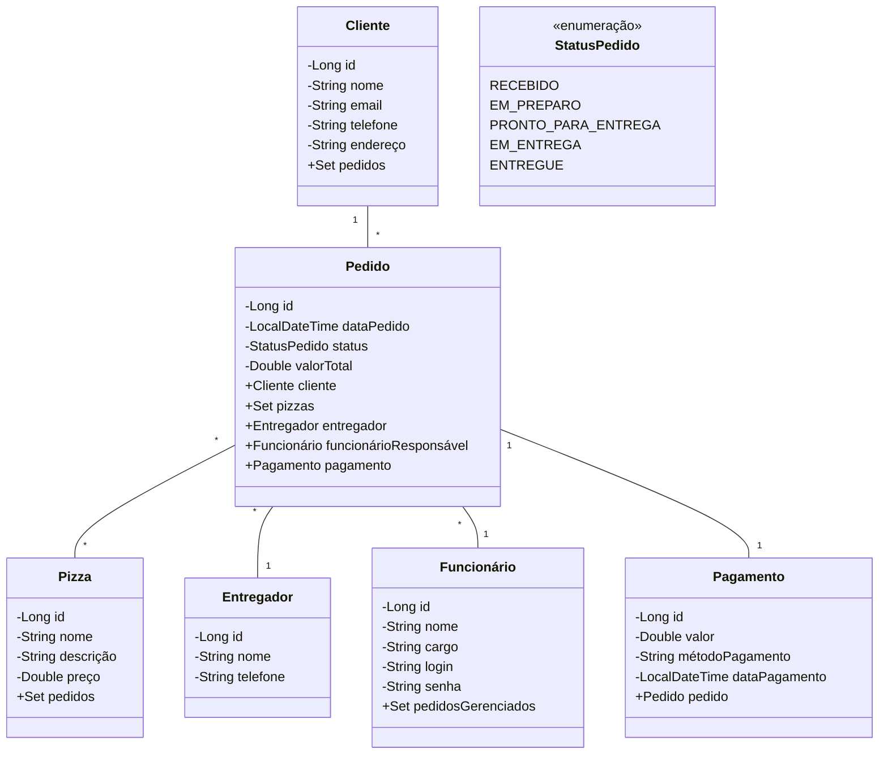

# PizzaOnLine

PizzaOnLine é um sistema de gerenciamento de pedidos para uma pizzaria online, onde clientes podem fazer pedidos de pizzas, que são gerenciados por funcionários e entregues por entregadores. Os clientes (`Client`) podem fazer vários pedidos (`Order`), que incluem informações sobre as pizzas solicitadas (`Pizza`), o funcionário responsável (`Employee`), e o entregador (`DeliveryPerson`). Cada pedido tem um status (`OrderStatus`), que acompanha o progresso desde o recebimento até a entrega, e está associado a um pagamento (`Payment`). 


## Funcionalidades

- Cadastro e gerenciamento de clientes
- Gerenciamento do cardápio de pizzas
- Realização e acompanhamento de pedidos
- Gerenciamento de funcionários e entregadores
- Processamento de pagamentos

## Modelo de Domínio

O diagrama Mermaid a seguir ilustra o modelo de domínio da aplicação PizzaOnLine:


## Fluxo Principal do Sistema: Compra de uma Pizza
```
sequenceDiagram
    participant Cliente
    participant API
    participant ControladorPedido
    participant ServiçoPedido
    participant RepositórioPedido
    participant Pagamento

    Cliente->>API: POST /api/orders (Cria um pedido)
    API->>ControladorPedido: Chama createOrder()
    ControladorPedido->>ServiçoPedido: Cria o pedido sem pagamento
    ServiçoPedido->>RepositórioPedido: Salva o pedido no banco de dados
    RepositórioPedido-->>ServiçoPedido: Retorna o pedido criado
    ServiçoPedido-->>ControladorPedido: Retorna o pedido criado
    ControladorPedido-->>API: Retorna o pedido criado
    API-->>Cliente: Pedido criado com ID

    Cliente->>API: GET /api/orders/{id} (Consulta status do pedido)
    API->>ControladorPedido: Chama getOrderById()
    ControladorPedido->>ServiçoPedido: Recupera o pedido
    ServiçoPedido->>RepositórioPedido: Busca o pedido pelo ID
    RepositórioPedido-->>ServiçoPedido: Retorna o pedido
    ServiçoPedido-->>ControladorPedido: Retorna o pedido
    ControladorPedido-->>API: Retorna o pedido
    API-->>Cliente: Pedido retornado

    Cliente->>API: PUT /api/orders/{id}/cooking (Atualiza para COOKING)
    API->>ControladorPedido: Chama updateOrderStatus("COOKING")
    ControladorPedido->>ServiçoPedido: Atualiza status do pedido
    ServiçoPedido->>RepositórioPedido: Salva pedido atualizado
    RepositórioPedido-->>ServiçoPedido: Retorna o pedido atualizado
    ServiçoPedido-->>ControladorPedido: Pedido atualizado
    ControladorPedido-->>API: Retorna o pedido atualizado
    API-->>Cliente: Status atualizado para COOKING

    Cliente->>API: PUT /api/orders/{id}/ready (Atualiza para READY_FOR_DELIVERY)
    API->>ControladorPedido: Chama updateOrderStatus("READY_FOR_DELIVERY")
    ControladorPedido->>ServiçoPedido: Atualiza status do pedido
    ServiçoPedido->>RepositórioPedido: Salva pedido atualizado
    RepositórioPedido-->>ServiçoPedido: Retorna o pedido atualizado
    ServiçoPedido-->>ControladorPedido: Pedido atualizado
    ControladorPedido-->>API: Retorna o pedido atualizado
    API-->>Cliente: Status atualizado para READY_FOR_DELIVERY

    Cliente->>API: PUT /api/orders/{id}/out-for-delivery (Atualiza para OUT_FOR_DELIVERY)
    API->>ControladorPedido: Chama updateOrderStatus("OUT_FOR_DELIVERY")
    ControladorPedido->>ServiçoPedido: Atualiza status do pedido
    ServiçoPedido->>RepositórioPedido: Salva pedido atualizado
    RepositórioPedido-->>ServiçoPedido: Retorna o pedido atualizado
    ServiçoPedido-->>ControladorPedido: Pedido atualizado
    ControladorPedido-->>API: Retorna o pedido atualizado
    API-->>Cliente: Status atualizado para OUT_FOR_DELIVERY

    Cliente->>API: PUT /api/orders/{id}/delivered (Atualiza para DELIVERED)
    API->>ControladorPedido: Chama updateOrderStatus("DELIVERED")
    ControladorPedido->>ServiçoPedido: Atualiza status do pedido
    ServiçoPedido->>RepositórioPedido: Salva pedido atualizado
    RepositórioPedido-->>ServiçoPedido: Retorna o pedido atualizado
    ServiçoPedido-->>ControladorPedido: Pedido atualizado
    ControladorPedido-->>API: Retorna o pedido atualizado
    API-->>Cliente: Status atualizado para DELIVERED

    Cliente->>API: POST /api/payments (Cria pagamento)
    API->>ControladorPedido: Cria pagamento para o pedido
    ControladorPedido->>Pagamento: Salva o pagamento
    Pagamento-->>ControladorPedido: Retorna o pagamento
    ControladorPedido-->>API: Pagamento criado
    API-->>Cliente: Pagamento registrado com sucesso

```

## Estrutura do Projeto

O projeto segue uma estrutura padrão de aplicação Spring Boot:

- `src/main/java/com/pizzaonline/api/`: Contém o código-fonte Java
  - `controller/`: Controladores da API REST
  - `model/`: Classes do modelo de domínio
  - `repository/`: Interfaces de acesso a dados
  - `service/`: Serviços de lógica de negócio
- `src/main/resources/`: Contém propriedades da aplicação e recursos estáticos
- `src/test/`: Contém classes de teste

## Configuração e Execução

1. Clone o repositório:
   ```bash
   git clone https://github.com/gazolla/PizzaOnLine.git
   ```

2. Navegue até o diretório do projeto:
   ```bash
   cd PizzaOnLine
   ```

3. Construa o projeto usando Maven:
   ```bash
   mvn clean install
   ```

4. Execute a aplicação:
   ```bash
   java -jar target/pizzaonline-0.0.1-SNAPSHOT.jar
   ```

A aplicação estará disponível em `http://localhost:8080`.

## Endpoints da API

A aplicação fornece os seguintes endpoints principais da API:

- `POST /api/orders`: Criar um novo pedido
- `PUT /api/orders/{id}/cooking`: Atualizar o status do pedido para EM_PREPARO
- `PUT /api/orders/{id}/ready`: Atualizar o status do pedido para PRONTO_PARA_ENTREGA
- `PUT /api/orders/{id}/out-for-delivery`: Atualizar o status do pedido para EM_ENTREGA
- `PUT /api/orders/{id}/delivered`: Atualizar o status do pedido para ENTREGUE

Para uma lista completa de endpoints e seu uso, consulte a documentação da API ou as classes de controladores no código-fonte.

## Contribuindo

Contribuições para o PizzaOnLine são bem-vindas! Sinta-se à vontade para enviar um Pull Request.

## Licença

Este projeto é licenciado sob a licença MIT - veja o arquivo [LICENSE](LICENSE) para mais detalhes.