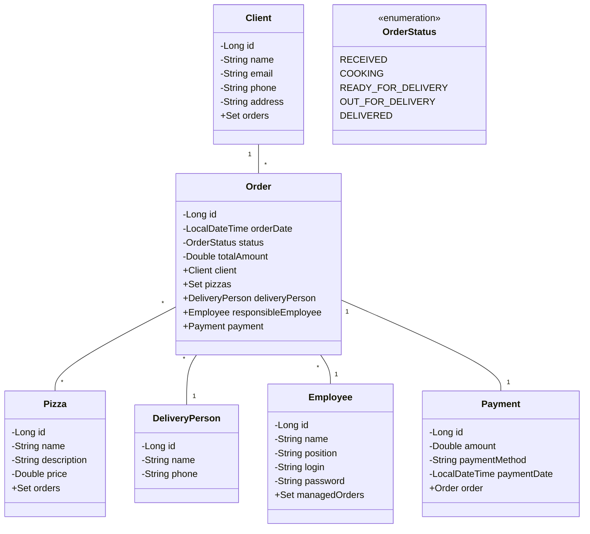

# PizzaOnLine

PizzaOnLine is a comprehensive online pizza ordering system built with Java Spring Boot. This application manages the entire process of ordering pizzas online, from customer registration to order delivery.

## Features

- Customer registration and management
- Pizza menu management
- Order placement and tracking
- Employee and delivery person management
- Payment processing

## Domain Model

The following Mermaid diagram illustrates the domain model of the PizzaOnLine application:



## Project Structure

The project follows a standard Spring Boot application structure:

- `src/main/java/com/pizzaonline/api/`: Contains the Java source code
    - `controller/`: REST API controllers
    - `model/`: Domain model classes
    - `repository/`: Data access interfaces
    - `service/`: Business logic services
- `src/main/resources/`: Contains application properties and static resources
- `src/test/`: Contains test classes

## Setup and Running

### Running with Maven
1. Clone the repository:
   ```
   git clone https://github.com/gazolla/PizzaOnLine.git
   ```

2. Navigate to the project directory:
   ```
   cd PizzaOnLine
   ```

3. Build the project using Maven:
   ```
   mvn clean install
   ```

4. Run the application:
   ```
   java -jar target/pizzaonline-0.0.1-SNAPSHOT.jar
   ```

The application will start and be available at `http://localhost:8080`.

### Running with Docker

1. Clone the repository:
   ```
   git clone https://github.com/gazolla/PizzaOnLine.git
   ```

2. Navigate to the project directory:
   ```
   cd PizzaOnLine
   ```

3. Build and run the application using Docker Compose:
   ```
   docker compose up --build
   ```

This will start the application in a Docker container. The app will be available at `http://localhost:8080`.

## API Endpoints

The application provides the following main API endpoints:

- `POST /api/orders`: Create a new order
- `PUT /api/orders/{id}/cooking`: Update order status to COOKING
- `PUT /api/orders/{id}/ready`: Update order status to READY_FOR_DELIVERY
- `PUT /api/orders/{id}/out-for-delivery`: Update order status to OUT_FOR_DELIVERY
- `PUT /api/orders/{id}/delivered`: Update order status to DELIVERED

For a complete list of endpoints and their usage, please refer to the API documentation or the controller classes in the source code.

## Contributing

Contributions to PizzaOnLine are welcome! Please feel free to submit a Pull Request.

## License

This project is licensed under the MIT License - see the [LICENSE](LICENSE) file for details.
